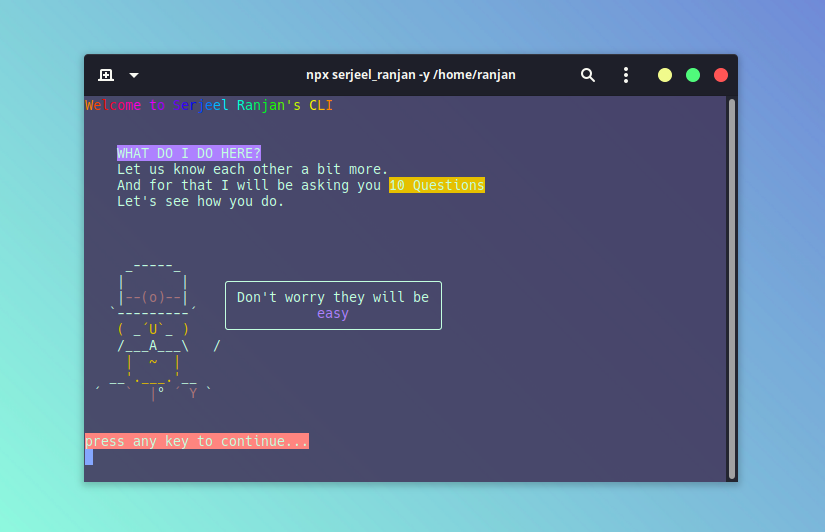
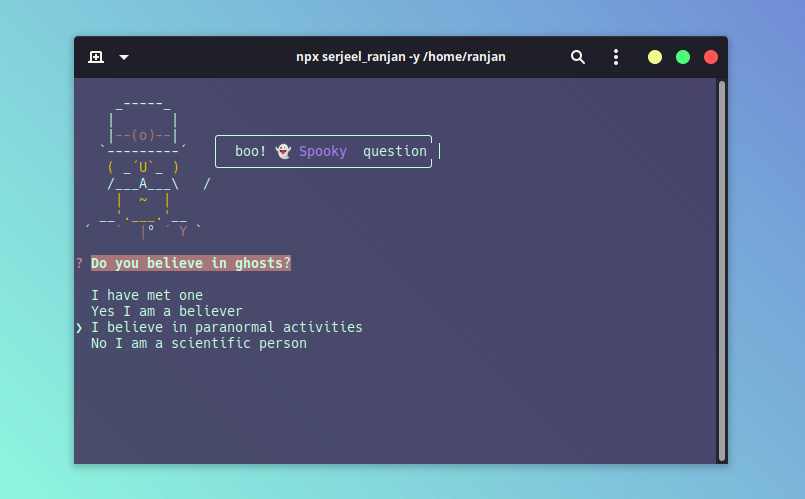
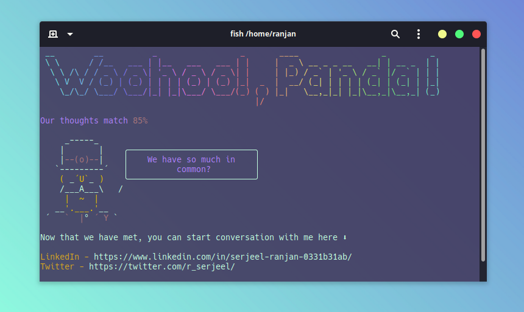

# Serjeel Ranjan's CLI Tool

A super fancy CLI tool. 





Try it now

```
npx serjeel_ranjan -y
```

## Packages Used

[chalk](https://github.com/chalk/chalk) | 
[inquirer](https://github.com/SBoudrias/Inquirer.js) |
[gradient-string](https://github.com/bokub/gradient-string) |
[chalk-animation](https://github.com/bokub/chalk-animation) |
[figlet](https://github.com/patorjk/figlet.js) |
[nanospinner](https://github.com/usmanyunusov/nanospinner)
